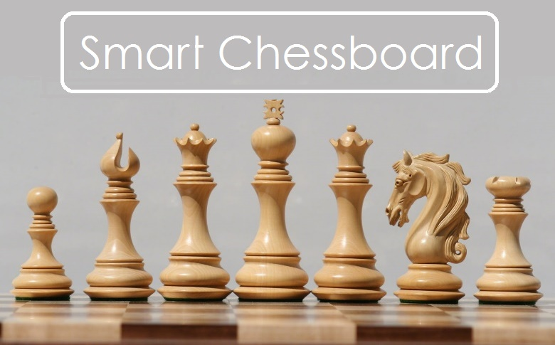

## Repository layout
|Directory|Description of contents|
|--|--|
|board| PCB design files for the chessboard|
|code| Raspberry Pi Zero firmware |
|docs| Design related documents |
|gui| GUI application built using python |

## Ideas for further development
- Connect the application with the chessboard using a wireless network. Interaction will be based on the pub-sub model (See socketio module)
- A 2 axis linear guide setup using stepper motors to move chess pieces using an electromagnet
- RFID based chess piece identification (Scanning using an array of 8 RFID readers mounted on a linear guide)

### Made with lots of ⏱️, 📚 and ☕ by [InputBlackBoxOutput](https://github.com/InputBlackBoxOutput)
