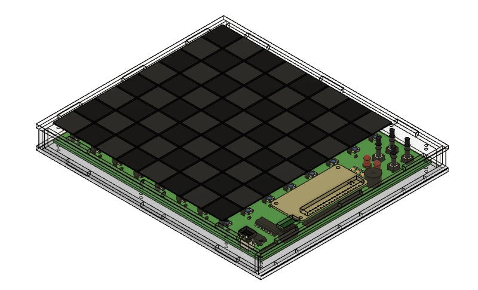

# Smart Chessboard

## Software flowchart
[View the flowchart](docs/flowchart.png)

## Hardware block diagram

## Repository layout
|Directory|Description of contents|
|--|--|
|board|PCB design files|
|code|Raspberry Pi Zero firmware|
|docs|Design related documents|
|enclosure|Enclosure design files|
|gui|GUI application built using Python 3|

## Ideas for further development
- Connect the chessboard via the internet to another computer
- A 2 axis linear guide setup using stepper motors to move chess pieces using an electromagnet
- RFID based chess piece identification. Scan achieved using an array of 8 RFID readers mounted on a linear guide

### Made with lots of ⏱️, 📚 and ☕ by [InputBlackBoxOutput](https://github.com/InputBlackBoxOutput)
